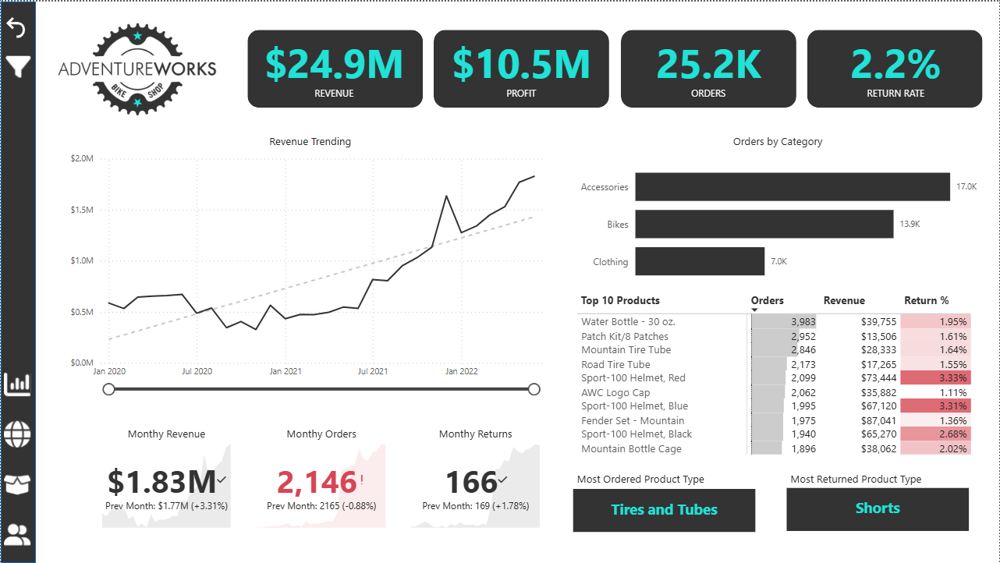
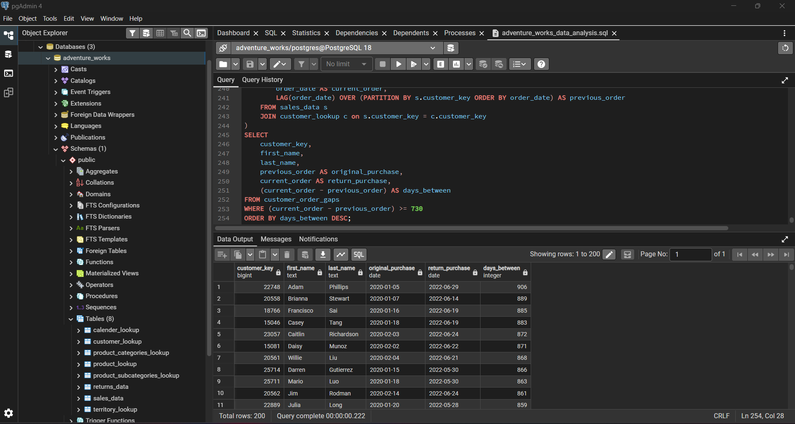

# Adventure_Works

## 1. Project Title / Headline  
This project combines a dynamic Power BI Dashboard for executive-level storytelling with a deep-dive PostgreSQL Analytics Library to answer complex business questions regarding sales performance, customer retention, and product health.

## 2. Short Description / Purpose  
The goal of this project is to transform raw transactional data into a high-level strategic tool for a global retail business. By linking Sales Records, Product Inventories, and Customer Demographics, this analysis identifies which products drive the most profit, which regions are growing the fastest, and how customer loyalty shifts over time.

## 3. Tech Stack  
This dashboard was developed using:
- **PostgreSQL** - Used as the primary relational database to store data and write queries
- **Excel** - Used for initial data exploration, quick pivot table validation, and handling raw CSV source files before database ingestion.
- **Power BI Desktop** – Main data visualization platform for interactive report building  
- **Power Query** – Used for cleaning and transforming raw transactional data  
- **DAX (Data Analysis Expressions)** – For KPIs like return rate, adjusted profit, and revenue per customer  
- **Data Modeling** – Relationships established among orders, customers, products, and geography tables  
- **File Format** – `.pbix` ,`.pdf`,`.sql` and `.csv`

## 4. Data Source  

- Source: Microsoft AdventureWorks Sales Data (Simulated)
- Period: January 2020 to June 2022
- Volume: 25.2K Orders, 17.4K Unique Customers
- Fact Tables:
  - Sales_Data: Tracks every individual order, quantity, and transaction date.
  - Returns_Data: Records returned items and return dates for quality auditing.
- Dimension Tables (Lookups):
  - Customer_Lookup: Contains demographic data (Occupation, Income, Education, and Gender).
  - Product_Lookup: Stores product details, categories, subcategories, and pricing/costing.
  - Calendar_Lookup: A specialized time-table used for Seasonality and Time-Intelligence analysis.
  - Territory_Lookup: Maps sales performance to global regions (North America, Europe, Pacific).

## 5. Features / Highlights

### • Business Problem
AdventureWorks needed a data-driven system to track performance across regions and product categories while identifying high-return items, top customers, and monthly sales trends.

### • Goal of the Dashboard
To offer a 360° view of sales performance across:
- Product-level trends and return rates
- Customer-level revenue insights
- Country-wise and category-wise demand
- Periodic profit/revenue tracking vs. targets

### • Walkthrough of Key Visuals

#### KPI Cards (Top Row)
- **Revenue**: $24.9M  
- **Profit**: $10.5M  
- **Orders**: 25.2K  
- **Return Rate**: 2.2%

#### Trend Analysis
- **Monthly Revenue**: Upward trend with 3.31% MoM growth  
- **Monthly Orders/Returns**: Interactive YoY and MoM comparisons  
- **Profit vs. Target**: Visual gauge and actuals line

#### Product Insights
- **Most Ordered Category**: Accessories (17K orders)  
- **Most Returned Product Type**: Shorts  
- **Top Products by Orders & Return %**:  
  - Water Bottle – 30 oz. (3,983 orders, 1.95% return)
  - Patch Kit, Tire Tubes, Helmets, etc.

#### Geo Breakdown
- 🇺🇸 United States
- 🇨🇦 Canada
- 🇫🇷 France
- 🇬🇧 UK
- 🇦🇺 Australia
- 🇩🇪 Germany

#### Customer Segmentation
- 17.4K Unique Customers  
- Avg Revenue per Customer: $1,431  
- Top Customer: Mr. Maurice Shan ($12.4K from 6 orders)  
- Segments by:
  - **Income Level** (Low, Avg, High)
  - **Occupation** (Professional, Skilled Manual, Management)

## Business Impact & Insights

- **Customer Targeting**: Skilled manual workers in 2022 contributed significantly to revenue (e.g., Ruben Sanchez at $4.6K)
- **Product Focus**: Accessories and safety gear (helmets) dominate order volume
- **Return Trends**: Shorts and apparel have higher return rates — potential for quality improvement or customer education
- **Geographic Performance**: Balanced revenue across Europe, North America, and Pacific regions
- **Revenue Per Customer**: Indicates potential for upselling or loyalty programs

## 6. SQL Logic and Insights

1. Total Revenue Check: Calculate the total revenue generated in millions for the entire dataset with the currency.
> SELECT CONCAT('$',ROUND(SUM(order_quantity * product_price)/1000000,1),'M') as overall_sales
FROM sales_data s
JOIN product_lookup p
ON s.product_key = p.product_key;

2. Multi-Dimensional Customer Segmentation Analysis: Write a series of queries that aggregate total revenue and order frequency across Gender, Marital Status, Occupation, and Education Level.
> SELECT 
gender,
COUNT(DISTINCT order_number) AS total_orders,
ROUND(SUM(s.order_quantity * p.product_price),2) as revenue
FROM customer_lookup c
JOIN sales_data s ON c.customer_key = s.customer_key
JOIN product_lookup p ON s.product_key = p.product_key
GROUP BY gender
ORDER BY revenue DESC;

> SELECT 
marital_Status,
COUNT(DISTINCT order_number) AS total_orders,
ROUND(SUM(s.order_quantity * p.product_price),2) as revenue
FROM customer_lookup c
JOIN sales_data s ON c.customer_key = s.customer_key
JOIN product_lookup p ON s.product_key = p.product_key
GROUP BY marital_Status
ORDER BY revenue DESC;

> SELECT 
occupation,
COUNT(DISTINCT order_number) AS total_orders,
ROUND(SUM(s.order_quantity * p.product_price),2) as revenue
FROM customer_lookup c
JOIN sales_data s ON c.customer_key = s.customer_key
JOIN product_lookup p ON s.product_key = p.product_key
GROUP BY occupation
ORDER BY revenue DESC;

> SELECT 
education_level,
COUNT(DISTINCT order_number) AS total_orders,
ROUND(SUM(s.order_quantity * p.product_price),2) as revenue
FROM customer_lookup c
JOIN sales_data s ON c.customer_key = s.customer_key
JOIN product_lookup p ON s.product_key = p.product_key
GROUP BY education_level
ORDER BY revenue DESC;

3. Monthly Revenue Trends: List the total revenue for each month
> SELECT 
	extract(MONTH from c.date) as month,
	to_char(date::DATE, 'Month') as month_name,
	ROUND(SUM(s.order_quantity * p.product_price),2) as monthly_sales
FROM sales_data s
JOIN product_lookup p ON s.product_key = p.product_key
JOIN calender_lookup c ON s.order_date = c.date
GROUP BY month,month_name
ORDER BY month;

4. Top 10 Popular Products: Which 10 products are sold the most and also show the revenue generated by these products.
> SELECT 
	p.product_name as product_name,
	COUNT(DISTINCT order_number) AS total_orders,
	ROUND(SUM(s.order_quantity * p.product_price),2) as revenue
FROM sales_data s
JOIN product_lookup p ON s.product_key = p.product_key
GROUP BY p.product_name
ORDER BY total_orders DESC
LIMIT 10;

5. Sales by Territory: Which country has the highest number of total orders?
> SELECT 
	t.country,
	COUNT(DISTINCT order_number) AS total_unique_orders
FROM sales_data s
JOIN territory_lookup t ON s.territory_key = t.sales_territory_key
GROUP BY t.country
ORDER BY total_unique_orders DESC;

6. Customer Loyalty (Churn): Identify "Inactive Customers"—those who haven't placed an order.
> SELECT 
    c.customer_key,
    INITCAP(c.first_name) AS first_name,
    INITCAP(c.last_name) AS last_name,
    c.email_address
FROM customer_lookup c
LEFT JOIN sales_data s ON c.customer_key = s.customer_key
WHERE s.customer_key IS NULL;

7. Unsold Inventory: Identify all products in the Product_Lookup table that have never been sold.
> SELECT 
    p.product_key,
    p.product_name,
    p.product_sku,
    p.product_price
FROM product_lookup p
LEFT JOIN sales_data s ON p.product_key = s.product_key
WHERE s.product_key IS NULL;

8. High-Value Customers: Find the top 10 customers by total spend. Show their full name, email address, orders placed and revenue.
> SELECT 
	c.customer_key,
	CONCAT(INITCAP(c.first_name),' ',INITCAP(c.last_name)) as full_name,
	c.email_address,
	COUNT(DISTINCT order_number) AS total_orders,
	ROUND(SUM(s.order_quantity * p.product_price),2) as revenue
FROM customer_lookup c
JOIN sales_data s ON c.customer_key = s.customer_key
JOIN product_lookup p ON s.product_key = p.product_key
GROUP BY c.customer_key,INITCAP(c.first_name),INITCAP(c.last_name),c.email_address
ORDER BY revenue DESC
LIMIT 10;

9. The Quality Control: Generate a report that identifies products that have both high sales volume (over 10,000 units) and significant return volume (over 5,000 units).
> SELECT 
    p.product_name,
    SUM(s.order_quantity) AS total_sold,
    SUM(r.return_quantity) AS total_returned
FROM product_lookup p
JOIN sales_data s ON p.product_key = s.product_key
JOIN returns_data r ON p.product_key = r.product_key
GROUP BY p.product_name
HAVING SUM(s.order_quantity) > 10000
   AND SUM(r.return_quantity) > 5000
ORDER BY total_returned DESC;

10. Weekend vs. Weekday: Analyze total revenue broken down by the Day of the Week.
> SELECT 
	extract(DOW from c.date) as day,
	to_char(date::DATE, 'FMDay') as day_name,
	ROUND(SUM(s.order_quantity * p.product_price),2) as day_of_week_sales
FROM sales_data s
JOIN product_lookup p ON s.product_key = p.product_key
JOIN calender_lookup c ON s.order_date = c.date
GROUP BY day,day_name
ORDER BY day;

11. Income Bracket Performance: Fragment customers into 'Low' (<$5k), 'Medium' ($5k-$10k), and 'High' (>$10k) income brackets and find the total revenue generated by each bracket.
> WITH customer_revenue AS (
SELECT 
	c.customer_key,c.first_name,c.last_name,
	ROUND(SUM(s.order_quantity * p.product_price),2) as revenue
FROM customer_lookup c
JOIN sales_data s ON c.customer_key = s.customer_key
JOIN product_lookup p ON s.product_key = p.product_key
GROUP BY c.customer_key,c.first_name,c.last_name
ORDER BY revenue DESC
),
>> tiered_customers AS (
SELECT 
		*,
		CASE
			WHEN revenue > 10000 THEN 'High'
			WHEN revenue between 5000 and 10000 THEN 'Medium'
			ELSE 'Low'
		END AS revenue_tier
FROM customer_revenue
)
>>> SELECT 
	revenue_tier,
	SUM(revenue) as revenue
FROM tiered_customers
GROUP BY revenue_tier
ORDER BY revenue DESC;

12. Month-over-Month Growth: Calculate the monthly revenue and the percentage change compared to the previous month.
> WITH monthly_sales AS (
SELECT 
	to_char(date::DATE, 'YYYY-MM') as month,
	ROUND(SUM(s.order_quantity * p.product_price),2) as monthly_revenue
FROM sales_data s
JOIN product_lookup p ON s.product_key = p.product_key
JOIN calender_lookup c ON s.order_date = c.date
GROUP BY montH
ORDER BY month
),
>> monthly_revenue_comparision AS (
SELECT
	month,monthly_revenue,
	LAG(monthly_revenue) OVER(ORDER BY month) as previous_month_revenue
FROM monthly_sales
)
>>> SELECT *,
	CONCAT(ROUND(((monthly_revenue - previous_month_revenue) / previous_month_revenue) * 100,2),'%')  as mom_growth_pct
FROM monthly_revenue_comparision;

13. Top 3 Customers per Occupation: Find the top 3 spending customers within each occupation category.
> WITH customer_spending AS (
SELECT 
	c.customer_key,
	INITCAP(c.first_name) as first_name,
	INITCAP(c.last_name) as last_name,
	c.occupation,
	ROUND(SUM(s.order_quantity * p.product_price),2) as revenue
FROM customer_lookup c
JOIN sales_data s ON c.customer_key = s.customer_key
JOIN product_lookup p ON s.product_key = p.product_key
GROUP BY c.customer_key,c.first_name,c.last_name,c.occupation
ORDER BY revenue DESC
),
>> ranked_customers AS ( 
SELECT *,
	DENSE_RANK() OVER(PARTITION BY occupation ORDER BY revenue DESC) AS ranking
FROM customer_spending
)
>>> SELECT *
FROM ranked_customers
WHERE ranking <=3

14. Rolling 7-Day Revenue: Calculate a 7-day rolling average of revenue to smooth out daily sales spikes.
> WITH daily_revenue AS (
SELECT 
	c.date,
	ROUND(SUM(s.order_quantity * p.product_price),2) as daily_sales
FROM sales_data s
JOIN product_lookup p ON s.product_key = p.product_key
JOIN calender_lookup c ON s.order_date = c.date
GROUP BY date
ORDER BY date 
)
>> SELECT 
	*,
	ROUND(AVG(daily_sales) OVER( ORDER BY date ROWS BETWEEN 6 PRECEDING AND CURRENT ROW),2) as moving_avg_7_day
FROM daily_revenue

15. Returning Customers: Write a query that identifies every instance where a customer had a "silent gap" of 730 days (2 years) or more between any two consecutive orders.
> WITH customer_order_gaps AS (
    SELECT 
        s.customer_key,
		INITCAP(c.first_name) as first_name,
		INITCAP(c.last_name) as last_name,
        order_date AS current_order,
        LAG(order_date) OVER (PARTITION BY s.customer_key ORDER BY order_date) AS previous_order
    FROM sales_data s
	JOIN customer_lookup c on s.customer_key = c.customer_key
)
>> SELECT 
    customer_key,
	first_name,
	last_name,
    previous_order AS original_purchase,
    current_order AS return_purchase,
    (current_order - previous_order) AS days_between
FROM customer_order_gaps
WHERE (current_order - previous_order) >= 730
ORDER BY days_between DESC;

## 7. Screenshots / Demos  

